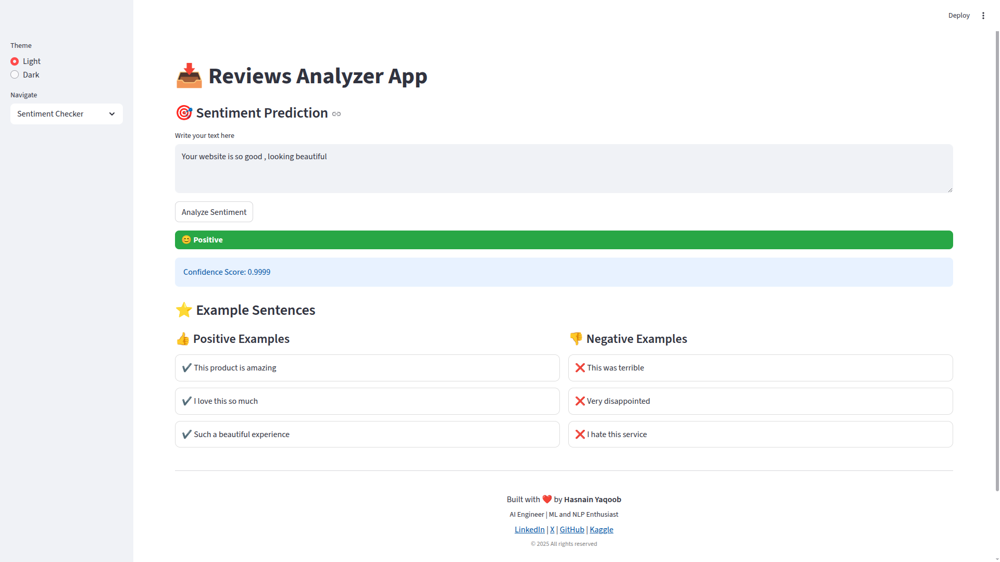
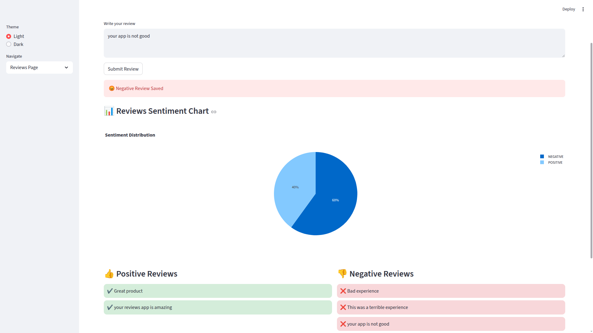

# ⭐ [Sentiment Analysis App using Transformers and Streamlit](https://reviewsanalyzer.streamlit.app/)

A simple and interactive web application that analyzes text sentiment and allows users to submit reviews.  
The app uses **Hugging Face Transformers** for sentiment analysis and **Streamlit** for a smooth interface.

---

## 📌 Features

### ✔ Real-time Sentiment Analysis
Analyze any text using a pre-trained **DistilBERT** model.

### ✔ Reviews Page
Submit reviews and automatically classify them as **positive** or **negative**.

### ✔ Local CSV Storage
All reviews are saved inside a CSV file for persistent storage.

### ✔ Organized View
Positive and negative reviews are displayed in two separate columns.

### ✔ Clean and Colorful UI
Styled interface with colored results, background themes, and a custom footer.

---

## 📂 Project Structure
```
📁 Sentiment_Analysis_App
│── app.py
│── Notebook.ipynb
│── README.md
│── requirements.txt
│── reviews.csv
```

---

## 🛠 Technologies Used
- Python  
- Streamlit  
- Transformers  
- PyTorch  
- Pandas  
- NumPy  

---


---

## 🖼 Demo Screenshots

  



---

## 📝 How It Works
- The app loads a Transformer sentiment model.  
- User enters text, and the model predicts **positive** or **negative**.  
- In the Reviews Page, user reviews are saved in a CSV file.  
- Submitted reviews are displayed under two columns based on their sentiment.

---

## 👨‍💻 Developer
**Hasnain Yaqoob**  
_AI Engineer | NLP and GenAI Learner_

🔗 LinkedIn: https://www.linkedin.com/in/hasnainyaqoob  
🔗 GitHub: https://github.com/hasnainyaqub  
🔗 Kaggle: https://www.kaggle.com/hasnainyaqooob  

---

## ⭐ Support
If you like this project, give the repo a **star**.  
It motivates the development of more projects like this.
